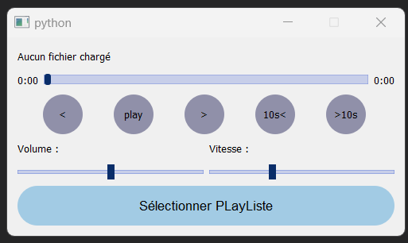

# Audio Player App

This is a simple audio player application built using **PyQt5** and **Python**. The app allows users to play audio files, pause, and skip tracks with a basic graphical user interface.

## Features

- Play, Pause, Stop audio.
- control speed & volume audio.
- Skip to the next or previous track.
- Simple, clean interface built with PyQt5.
- Supports popular audio formats (e.g., MP3, WAV, etc.).

## Live Preview


## Requirements

To run this application, you will need:

- Python 3.x
- PyQt5
- Pygame (for audio playback)

### Install Dependencies

Before running the app, make sure to install the required dependencies by running:

```bash
pip install pyqt5 pygame
